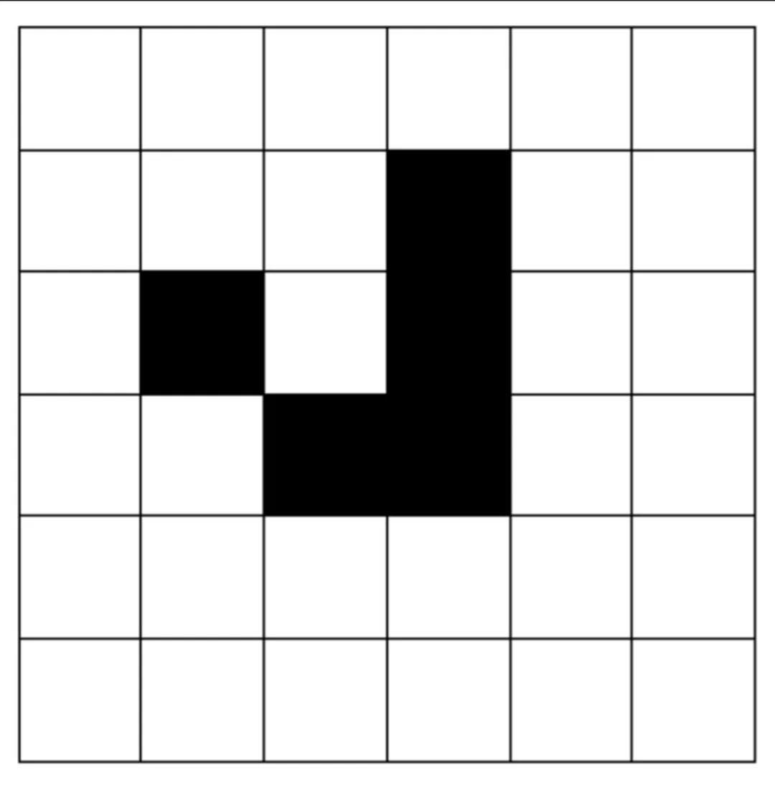

   

     

# GameOfLifeChallenge2025

 Crestron Game of Life Challenge 2025 Presented by Tim Gray.

**Participants of the live in person challenge will need the vtpro file and optionally the pdf of the presentation.**

#### What is the Game of Life?

[Conway's Game of life](https://en.wikipedia.org/wiki/Conway%27s_Game_of_Life)   is a cellular automaton simulation  Complete Details are in the Wikipedia article linked.   The rules are simple.   

1. Any live cell with fewer than two live neighbors dies, as if by underpopulation.
2. Any live cell with two or three live neighbors lives on to the next generation.
3. Any live cell with more than three live neighbors dies, as if by overpopulation.
4. Any dead cell with exactly three live neighbors becomes a live cell, as if by reproduction.
5. The playfield MUST be processed completely before updating.

Most implementations use a wrap around of the playfield,  left edge  checks the right edge as if it was a sphere, same for top to bottom.

Below is an example of a Glider, this will stay alive and move across the play field. There are many more stable shapes, the Wikipedia link is a great place to start.

 After the challenge is completed this repository will hold the Example solution in Simpl, Simpl+ and C#

#### **Things to Note**

Will the solutions be elegant perfect examples?  not a chance. but they will function. The code is not complete, there is no error checking code included for clairity.

## License

Crestron Simpl example code is licensed to Crestron dealers and Crestron Service Providers (CSPs) under a limited non-exclusive, non-transferable Software Development Tools License Agreement. Crestron product operating system software is licensed to Crestron dealers, CSPs, and end-users under a separate End-User License Agreement. Both of these Agreements can be found on the Crestron website at www.crestron.com/legal/software-license-agreement. The product warranty can be found at www.crestron.com/legal/sales-terms-conditions-warranties. The specific patents that cover Crestron products are listed at www.crestron.com/legal/patents. Certain Crestron products contain open source software. For specific information, visit www.crestron.com/legal/opensource-software. Crestron, the Crestron logo, Crestron Virtual Control, VC-4, 4-Series, 4-Series Control System, Crestron Studio, Crestron Toolbox, Crestron XiO Cloud, SIMPL+, and VT-Pro e are either trademarks or registered trademarks of Crestron Electronics, Inc. in the United States and/or other countries. Microsoft Visual Studio and Active Directory is either a trademark or a registered trademark of Microsoft Corporation in the United States and/or other countries. Other trademarks, registered trademarks, and trade names may be used in this document to refer to either the entities claiming the marks and names or their products. Crestron disclaims any proprietary interest in the marks and names of others. Crestron is not responsible for errors in typography or photography. ©2025 Crestron Electronics, Inc.
